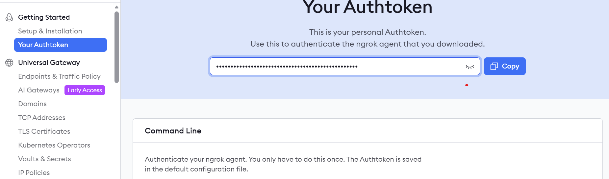
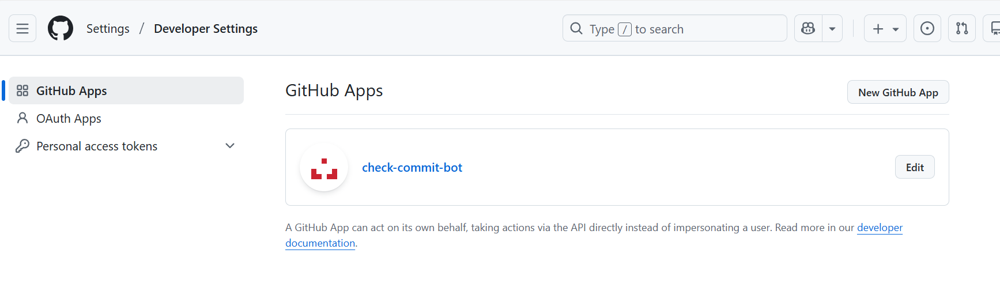
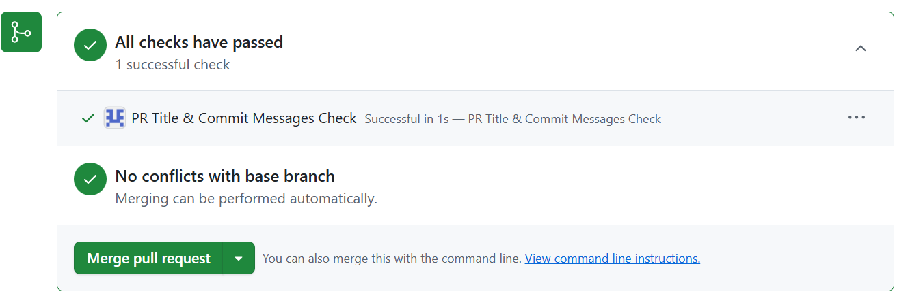

## Description
This project aims to help understand how `check_runs` work on GitHub using GitHub Apps.

The project provides a Python script called `commit-checks-api.py` that creates a `check_run` in your GitHub repository.

The `check_run` simply checks if the commits in your PR contain a valid keyword supported by Semantic Release.

This PR check could be implemented using commitlint to verify if PR commits have valid commit titles. However, the purpose of this project is to demonstrate how a basic `check_run` works on GitHub.

## Prerequisites

- **Python 3.11** (or higher)
- **Flask** (to run the webhook server)
- **Requests** (for HTTP requests to GitHub API)
- **PyJWT** (to generate JWT for the GitHub App)
- **python-dotenv** (to load environment variables from a `.env` file)
- **Ngrok account** (to expose your local Flask server to the internet for GitHub webhooks)
- **Ngrok authorization token** (to authenticate your ngrok client)
- **GitHub App installed** in the target repository
- `.env` file configured with the following variables:
  - `APP_ID` → your GitHub App ID
  - `INSTALLATION_ID` → the installation ID of your GitHub App
  - `WEBHOOK_SECRET` → secret set in the GitHub App webhook configuration
  - `PRIVATE_KEY_PATH` → path to your GitHub App private key file
  - `FULL_REPO_NAME` → repository in the format `<owner>/<repo-name>` where checks will run

## How to create an acount in Ngrok and create a public endpoint

Log into https://ngrok.com/ and create an account.

Get your Authorization token in `Your Authtoken`.

Once you get your Authtoken just run the following command in your terminal:

```shell
ngrok config add-authtoken <your-authtoken>
```
The `Ngrok` dashboard looks like this:



Finally, in your terminal run:

```shell
ngrok http 3000
```

This will create a public endpoint in Ngrok that forwards your GitHub payload events in JSON to your local flask running on port 3000 locally.

You can visualize this public endpoint from the Ngrok dashboard in `Endpoints & Traffic Policy`

Example output when you run `ngrok http 3000` in your terminal:

```shell
ngrok                                                                 (Ctrl+C to quit)                                                                                      ⚠️ Free Users: Agents ≤3.19.x stop connecting 2/17/26. Update or upgrade: https://ngro                                                                                      Session Status                online                                                  Account                       enriqueta8585 (Plan: Free)                              Update                        update available (version 3.34.1, Ctrl-U to update)     Version                       3.30.0                                                  Region                        Europe (eu)                                             LLatency                      33ms                                                    eb Interface                     http://127.0.0.1:4040                                   Forwarding                    https://gwenda-unlibelled-xxx                                                                     Connections                   ttl     opn     rt1     rt5     p50     p90                           0       0       0.00    0.00    0.00       
```

## Creat a Github APP and install it in your repository

In your GitHub account create a new GitHub App on `New GitHun App`:



You must provide the following information:

**GitHub App name** for example `check-commit-bot`.
**Homepage URL** this is the URL of your repository for the events that we want to monitor. For example: `https://github.com/<owner>/<repository-name>`.
**Webhook URL** this is the public endpoint that we get when we run `ngrok http 3000`.
For example: `https://gwenda-unlibelled-xxx.ngrok-free`.
**Webhook secret** Create a webhook secret. For example `mysecret`.
**Private keys** Create a private key in `PEM` format and save it in the same repository where you'll run the scripts.

In `Permissions & events` select: 

`Repository permissions` and give the following permissions:

- `Checks`: Read and write
- `Contents`: Read-only
- `Pull requests`: Read and write

In `Organzation permissions`:

- `Events`:  Read-only

Once everything is setup you just need to install your GitHub APP in your repository in `Instapp App`. 
Choose  your account and install the GitHub APP in your specific repository.

## Crate your .env file

The script `commit-checks-api.py` will need some environment variable:

```shell
APP_ID="xxxxx"
INSTALLATION_ID="yyyy"
WEBHOOK_SECRET="mysecret"
PRIVATE_KEY_PATH="commit-checks-api-private-key.pem"
NGROK_AUTH_TOKEN="xxxxxxxxxxx"
FULL_REPO_NAME="owner/repository-name"
```

Save your environment variables in the path wher you are going to run the scripts under a `.env` file.

Some of this environment variables can be gathered from your GitHub APP.

The `APP_ID` is the applicaiton ID of your GitHub APP and we can get it from the `General` tag in your GitHub APP information dashboard <https://github.com/settings/apps/your-gihub-app-name>

The `INSTALLATION_ID` is something that we cannot get from the dashboard directly. Hence, we created a simple script `installation-id.py` to the the installation ID easier. 

Before executing this script make sure to source your `APP_ID` and `PRIVATE_KEY_PATH` in your terminal.

The output will look something like this:

```shell
 py installation-id.py
JWT generated correctly!
Installation IDs:
- ID: xxxxxx | Account: Your-Account
```

The `PRIVATE_KEY_PATH` is the private key in `PEM` format that you created under your `GitHub APP` in `General`-`Private keys` in <https://github.com/settings/apps/<your-gihub-app-name>. 

Download it and save it in the same path where you are going to execute the scripts.

The `NGROK_AUTH_TOKEN` is the `Ngrok` token that you created previously befre executing `ngrok http 3000`.

The `FULL_REPO_NAME` is the name of the repo where you have installed your GitHub APP.

**When you create and save these env vars in your `.env` file. Source it before executing the scrip `commit-checks-api.py`**

## Executing the script commit-checks-api.py

This script basically will create an installation token through a JWT token, which is necessary to create the `check-run` in your GitHub Pull Request.

This simple `check_run` verifies if the PR title and commits include one of the following valid keywords:

```shell
["feat", "fix", "docs", "style", "refactor", "test", "chore"]
```

If both conditions success the check-run will pass. Otherwise, it will fail in the PR.

The `check-run` will be named `PR Title & Commit Messages Check`.

Also, we will analyze the `opened` and `synchronized` actions form the `Pull request` GitHub events.

So basically you will have to run in one terminal `ngrok http 300` and in a second terminal the script `commit-checks-api.py`. 

When you open a Pull Request or update an existing one you will see the following `check-run` in your PR:



## Testing the installation token test.py

The repository includes a `test.py` script to test the installation token with the env vars in `.env` file.